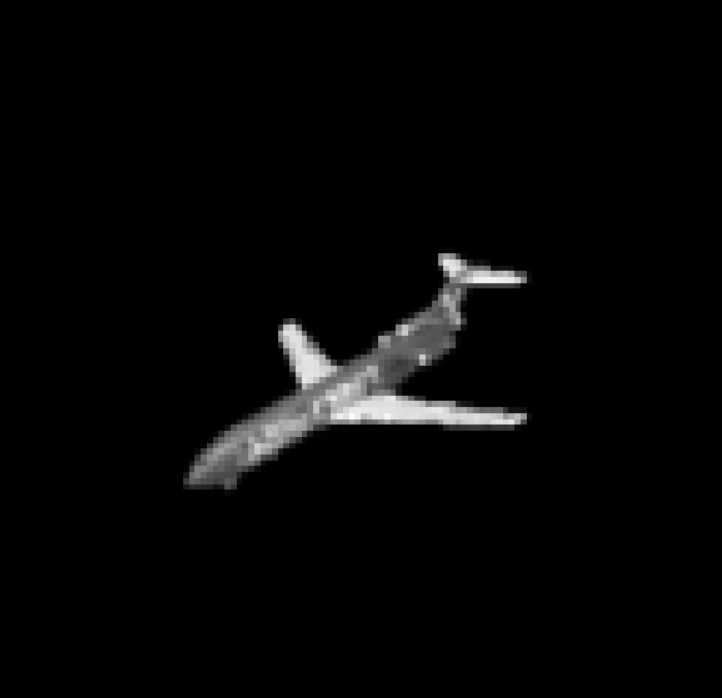
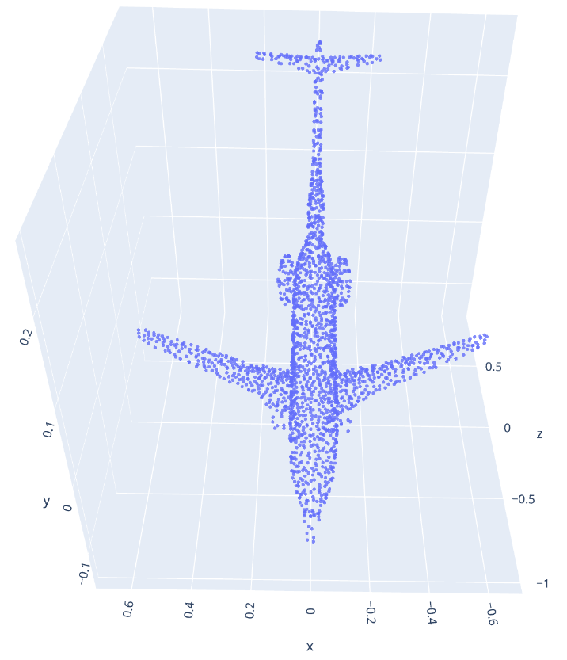
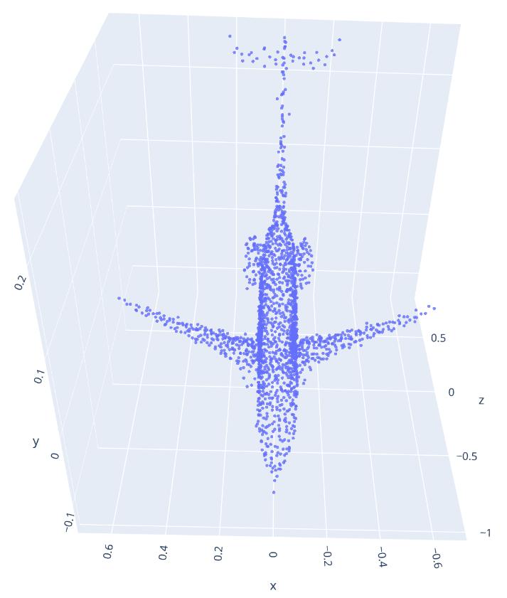
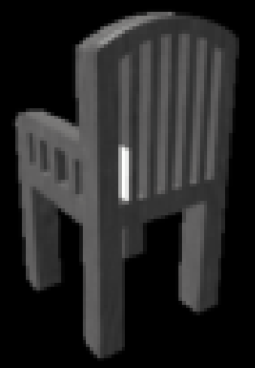
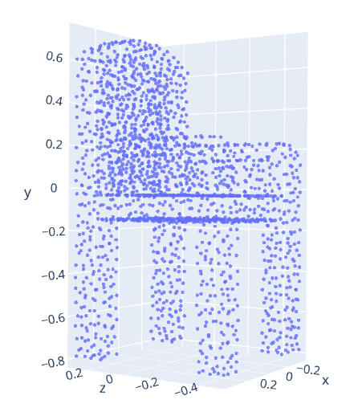
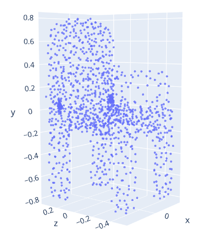
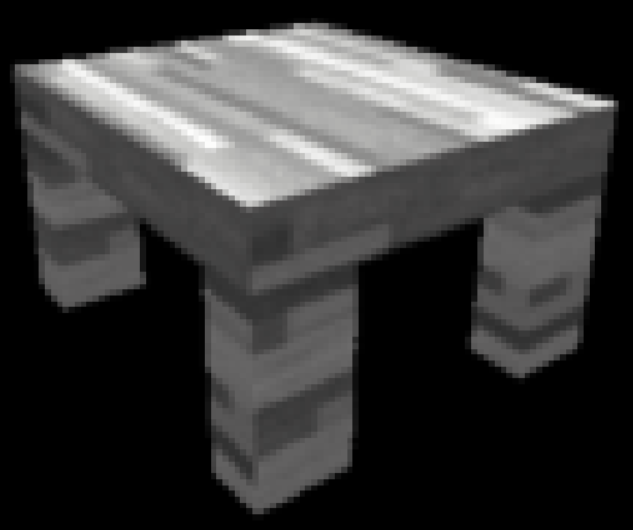
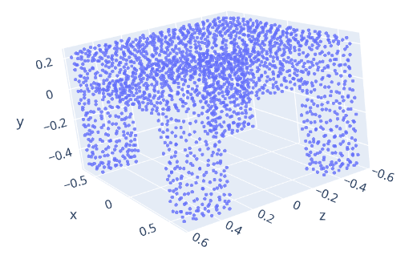
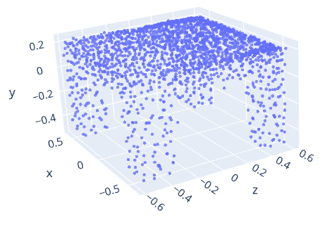

A Pytorch implementation of the paper: Pixel2point: 3D Object Reconstruction From a Single Image Using CNN and Initial
Sphere

- A. J. Afifi, J. Magnusson, T. A. Soomro, and O. Hellwich,
  “[Pixel2point: 3D Object Reconstruction From a Single Image Using CNN and Initial Sphere,](https://ieeexplore.ieee.org/document/9305196)
  ” IEEE Access, vol. 9, pp. 110–121, 2021, doi: 10.1109/ACCESS.2020.3046951.

|                            Input 2D Image                            |                       Ground Truth Point Cloud                       |                          Output Point Cloud                          |
| :------------------------------------------------------------------: | :------------------------------------------------------------------: | :------------------------------------------------------------------: |
|  |  |  |
|  |  |  |
|  |  |  |

## Environment

``` bash
conda env create -f ./environment.yml
conda activate pixel2point
```

The code has been tested on Ubuntu 20.04, Python 3.9.13, Pytorch 1.12.1, Pytorch3D 0.7.0, CUDA 11.7

## Dataset

- Shapenet Point cloud (shapenetcorev2_hdf5_2048.zip,
  0.98G): [antao97/PointCloudDatasets](https://github.com/antao97/PointCloudDatasets)
- Shapenet renderer (image.tar,
  30G): [Xharlie/ShapenetRender_more_variation](https://github.com/Xharlie/ShapenetRender_more_variation)

> required to modify the dataset path in the `./lib/settings.py`

## Training

``` bash
python main.py
```

## Testing

```bash
python test.py
```

> required to modify the model path in `./lib/settings.py`

## Notes

- 2022.09.18
    - Loss Function: Not implemented Earth Mover's Distance(EMD)
    - Dataset: Not tested on Pix3D
    - Model: Incomplete Fully Connected Layer because CUDA out of memory

- 2022.09.23
    - The "pytorch3d" chamfer distance on the CNN layer is non-deterministic at backward propagation on the GPU.
    - This repo uses the "pytorch" function to calculate the chamfer distance to make the loss function deterministic on the CNN layers (Increase execution time by 50%).
